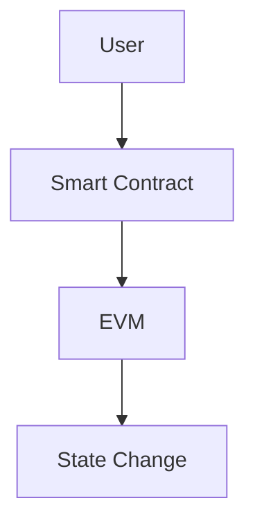

# Roadmap: Future Feature Brainstorm

**Date**: 2025-10-03
**Purpose**: Brainstorm innovative features to enhance Inevitable Ethereum as an educational resource
**Context**: Post-Session 8, with 12 new features implemented and solid foundation in place

---

## Feature Categories

1. [Learning & Education](#1-learning--education)
2. [Content Discovery](#2-content-discovery)
3. [Community & Social](#3-community--social)
4. [Personalization](#4-personalization)
5. [Content Enhancement](#5-content-enhancement)
6. [Accessibility & UX](#6-accessibility--ux)
7. [Analytics & Insights](#7-analytics--insights)
8. [Developer Experience](#8-developer-experience)

---

## 1. Learning & Education

### 1.1 Reading Progress Tracking
**Description**: Track user's reading progress across all articles with visual indicators
**Features**:
- Mark articles as "Read" / "In Progress" / "Not Started"
- Progress percentage for each article (scroll depth)
- "Continue Reading" quick links on homepage
- Progress saved to localStorage
- Visual badges/checkmarks in sidebar

**Value**: Helps learners track their educational journey
**Complexity**: Medium
**Dependencies**: localStorage (already used for bookmarks)

---

### 1.2 Learning Paths / Curricula
**Description**: Guided sequences of articles for specific learning goals
**Features**:
- Pre-defined paths: "Ethereum Basics", "DeFi Deep Dive", "Cryptography Fundamentals"
- Progress tracking through paths
- Estimated completion time
- Prerequisites and next steps
- Path difficulty levels

**Value**: Structured learning for beginners
**Complexity**: High (requires content curation)
**Dependencies**: Reading progress tracking

**Example Paths**:
- "Ethereum Basics" → Background → Finance → Concepts → Ethereum Core
- "DeFi Journey" → Markets → Banking → Ethereum → DeFi
- "Cryptography Path" → Math → Crypto History → Modern Crypto → Zero-Knowledge

---

### 1.3 Interactive Quizzes
**Description**: Knowledge checks at end of articles
**Features**:
- Multiple choice questions
- Immediate feedback
- Explanation for correct/incorrect answers
- Optional: Score tracking
- Optional: Certificates for completed paths

**Value**: Reinforces learning, engagement
**Complexity**: High (requires question authoring)
**Dependencies**: Content additions to MDX frontmatter

---

### 1.4 Glossary / Terms Database
**Description**: Hover-over definitions for technical terms
**Features**:
- Inline term definitions (like Wikipedia)
- Full glossary page with search
- Terms linked to relevant articles
- "First mention" highlighting in articles
- Visual indicator for defined terms

**Value**: Reduces cognitive load for beginners
**Complexity**: High (requires term database)
**Implementation**: Could use MDX component `<Term>` or markdown footnote syntax

**Example**:
```md
The [[Ethereum Virtual Machine]] (EVM) is a...
```
Hover over "Ethereum Virtual Machine" → tooltip with definition + link to full article

---

## 2. Content Discovery

### 2.1 Enhanced Search
**Description**: Improve current Fuse.js search with filters and highlighting
**Features**:
- Filter by category, difficulty, tags
- Search within current category
- Keyboard navigation in results (already have shortcuts)
- Highlight search terms in results
- "Did you mean?" suggestions
- Recent searches

**Value**: Faster content discovery
**Complexity**: Medium
**Dependencies**: Current search implementation

---

### 2.2 Tag Exploration Page
**Description**: Browse and discover content by tags
**Features**:
- Tag cloud visualization (size = article count)
- Tag-specific pages showing all articles
- Related tags suggestions
- Most popular tags
- Tag filtering in sidebar

**Value**: Alternative navigation method
**Complexity**: Low
**Dependencies**: Existing tag system in frontmatter

**Example**: `/tags/cryptography` shows all articles tagged with "cryptography"

---

### 2.3 Timeline / Historical View
**Description**: Browse content chronologically (especially for background/history articles)
**Features**:
- Interactive timeline visualization
- Filter by year, decade, topic
- "Story mode" - narrative flow through historical events
- Visual markers for key events

**Value**: Contextualizes financial and tech history
**Complexity**: High (requires timeline visualization library)
**Best suited for**: Background category articles

**Example**: 1492 (Medici Banking) → 1907 (Panic) → 1929 (Great Depression) → 2008 (GFC) → 2009 (Bitcoin)

---

### 2.4 Content Relationships Graph
**Description**: Visual graph showing how articles relate to each other
**Features**:
- Interactive network diagram
- Click to navigate between related articles
- Highlight current article and connections
- Filter by category or tag
- "6 degrees of Ethereum" exploration

**Value**: Discover unexpected connections, see big picture
**Complexity**: Very High (requires graph visualization)
**Libraries**: D3.js, React Flow, or Cytoscape.js

---

### 2.5 "Discover Mode"
**Description**: Serendipitous content discovery with rotation
**Features**:
- "Random" button (already have `/random` route!)
- "Explore Similar" based on current article
- "Because you read X, you might like Y"
- Daily/weekly featured article
- "Hidden gems" - underexplored content

**Value**: Encourages exploration beyond intended reading
**Complexity**: Low (random already exists) to Medium (recommendations)
**Dependencies**: Article metadata, optional: reading history

---

## 3. Community & Social

### 3.1 Comments / Discussions
**Description**: Allow readers to discuss articles
**Options**:
- **Option A**: GitHub Discussions integration (leverages existing repo)
- **Option B**: External service (Disqus, Utterances)
- **Option C**: Custom comment system (complex)

**Recommendation**: **GitHub Discussions** (Option A)
**Rationale**:
- No additional infrastructure
- Users have GitHub accounts (tech audience)
- Moderation tied to repo
- Can cross-reference code/issues
- Free and open source

**Features**:
- Per-article discussion threads
- Link to GitHub discussion at bottom of article
- Comment count indicator
- Recent discussions feed

**Value**: Community engagement, Q&A, diverse perspectives
**Complexity**: Low (integration) to High (custom)

---

### 3.2 User Contributions
**Description**: Enable community content contributions
**Features**:
- "Suggest Edit" workflow (already have "Edit on GitHub"!)
- "Suggest New Article" form
- Contribution guidelines page
- Contributors hall of fame
- Acknowledgments in articles

**Value**: Scalable content creation, community ownership
**Complexity**: Medium (requires editorial workflow)
**Dependencies**: GitHub PR process

---

### 3.3 Social Sharing Enhancements
**Description**: Expand existing share button functionality
**Features**:
- Twitter/X card previews (already have OG images)
- Pre-filled quote tweets with key excerpts
- Share specific sections (deep linking)
- "Share as image" - generate quote cards
- Track most-shared articles

**Value**: Organic growth, virality
**Complexity**: Medium
**Dependencies**: Current share button, OG images

---

## 4. Personalization

### 4.1 Reading History & Analytics
**Description**: Personal dashboard showing reading activity
**Features**:
- Recently viewed articles
- Reading time logged
- Articles read count
- Reading streaks
- Topics explored (tag breakdown)
- Estimated knowledge level

**Value**: Gamification, motivation
**Complexity**: Medium
**Dependencies**: localStorage or user accounts

---

### 4.2 Custom Reading Lists
**Description**: Extend bookmarks to organized lists
**Features**:
- Multiple lists (e.g., "To Read", "Research", "Favorites")
- Drag-and-drop reordering
- List sharing (export as URL or JSON)
- Import/export bookmarks
- Collaborative lists (advanced)

**Value**: Better personal organization
**Complexity**: Medium
**Dependencies**: Existing bookmark system

---

### 4.3 Personalized Homepage
**Description**: Customize homepage based on preferences
**Features**:
- "Pick your interests" onboarding
- Reorder category tiles
- Pin favorite articles
- Hide categories
- Customizable "Continue Reading" section
- Difficulty preference filter

**Value**: Tailored experience
**Complexity**: Medium
**Dependencies**: localStorage for preferences

---

### 4.4 Dark/Light Mode Enhancements
**Description**: Expand existing theme support
**Features** (already have dark mode toggle!):
- Additional themes: "Sepia", "High Contrast", "Solarized"
- Time-based auto-switching
- Per-page theme override
- Custom theme builder (advanced)

**Value**: Accessibility, personalization
**Complexity**: Low to Medium
**Dependencies**: Existing next-themes setup

---

## 5. Content Enhancement

### 5.1 Interactive Visualizations
**Description**: Embed interactive charts and diagrams
**Features**:
- Interactive graphs (supply curves, blockchain structures)
- Animated timelines
- Zoomable network diagrams
- Parameter sliders (e.g., interest rate effects)
- Data visualizations (gas prices, TVL over time)

**Value**: Better understanding of complex concepts
**Complexity**: High
**Tools**: D3.js, Recharts, or custom React components
**Implementation**: New MDX components

**Examples**:
- Interactive supply/demand curves for economics articles
- Blockchain visualization showing block structure
- Animated Merkle tree construction

---

### 5.2 Code Playgrounds
**Description**: Executable code examples in articles
**Features**:
- Embedded Solidity editor (Remix integration?)
- JavaScript/TypeScript REPL
- "Try it yourself" code samples
- Syntax highlighting (already have via MDX!)
- Fork and experiment

**Value**: Learn by doing
**Complexity**: Very High
**Options**:
- Embed CodeSandbox/StackBlitz
- Integrate Remix IDE for Solidity
- Custom JS REPL component

---

### 5.3 Embedded Videos & Podcasts
**Description**: Supplement text with multimedia
**Features**:
- YouTube embed support in MDX
- Audio player for podcast episodes
- Video timestamps linked to article sections
- Transcript integration
- "Watch" vs "Read" mode

**Value**: Multiple learning modalities
**Complexity**: Low (embeds) to Medium (custom players)
**Implementation**: New MDX components for `<Video>` and `<Audio>`

---

### 5.4 Mathematical Notation Enhancements
**Description**: Improve existing KaTeX rendering
**Features** (already have rehype-katex!):
- Copy LaTeX source
- Step-by-step equation derivations
- Interactive equation explorer
- Equation search/reference
- Accessible math (screen reader support)

**Value**: Better for technical content
**Complexity**: Medium
**Dependencies**: Existing KaTeX setup

---

### 5.5 Diagramming Support
**Description**: Visual diagrams for complex concepts
**Features**:
- Mermaid.js support for flowcharts
- Architecture diagrams
- Entity relationship diagrams
- Sequence diagrams for protocols
- SVG diagrams with tooltips

**Value**: Visual learners
**Complexity**: Medium
**Implementation**: Mermaid.js MDX plugin

**Example**:


---

## 6. Accessibility & UX

### 6.1 Text-to-Speech (Read Aloud)
**Description**: Audio narration of articles
**Options**:
- **Option A**: Browser Web Speech API (free, instant)
- **Option B**: Pre-generated audio (higher quality, expensive)

**Recommendation**: **Web Speech API** (Option A)
**Features**:
- Play/pause/speed controls
- Progress indicator synced with text
- Highlight current paragraph
- Background listening mode
- Voice selection

**Value**: Accessibility, multitasking
**Complexity**: Medium
**Browser Support**: Good (Chrome, Safari, Edge)

---

### 6.2 Dyslexia-Friendly Mode
**Description**: Typography optimized for dyslexia
**Features**:
- OpenDyslexic font option
- Increased letter spacing
- Reduced line length (60-70 chars)
- Colored overlays
- Bold first letter of words
- Toggle via accessibility menu

**Value**: Inclusivity, broader audience
**Complexity**: Low
**Dependencies**: CSS custom properties (already have!)

---

### 6.3 Focus Mode (Distraction-Free Reading)
**Description**: Hide UI elements for immersive reading
**Features**:
- Hide sidebar and TOC
- Remove header/footer
- Dim/hide images (optional)
- Zen mode color scheme
- Keyboard shortcut to toggle
- Remember preference

**Value**: Deep focus, long-form reading
**Complexity**: Low
**Implementation**: CSS classes + localStorage

---

### 6.4 Print Optimization
**Description**: Better print/PDF generation
**Features** (already have print styles in globals.css!):
- Preserve links as footnotes
- Include article metadata
- Page break optimization
- QR code to article URL
- "Print to PDF" button with custom styling

**Value**: Offline reference, studying
**Complexity**: Low to Medium
**Dependencies**: Existing print styles

---

### 6.5 Language Translation Support
**Description**: Multi-language content
**Options**:
- **Option A**: Browser-based translation (Google Translate widget)
- **Option B**: Pre-translated content (manual/AI)
- **Option C**: Community translations

**Recommendation**: **Browser-based** (Option A) for MVP, **Community translations** (Option C) long-term

**Value**: Global accessibility
**Complexity**: Low (widget) to Very High (full i18n)

---

## 7. Analytics & Insights

### 7.1 Reading Statistics (Public)
**Description**: Site-wide engagement metrics
**Features**:
- Most-read articles (all-time, this month, this week)
- Trending topics
- Average reading time per category
- Most bookmarked articles
- Popular learning paths
- Visitor statistics

**Value**: Social proof, content insights
**Complexity**: Medium
**Privacy**: Aggregate data only (no user tracking)
**Implementation**: Privacy-respecting analytics (Plausible, Fathom)

---

### 7.2 Content Difficulty Heatmap
**Description**: Visual guide to content complexity
**Features**:
- Difficulty distribution chart
- Readability scores (Flesch-Kincaid)
- Estimated prior knowledge required
- Difficulty badges in sidebar
- Filter articles by difficulty

**Value**: Helps learners choose appropriate content
**Complexity**: Medium
**Dependencies**: Difficulty tags in frontmatter (already have!)

---

### 7.3 Article Dependencies / Prerequisites
**Description**: Show required reading for complex articles
**Features**:
- "Before reading this, we recommend..." section
- Dependency graph visualization
- Check off prerequisites
- Guided reading order
- Difficulty progression

**Value**: Reduces confusion, better learning paths
**Complexity**: Medium
**Implementation**: New frontmatter field: `prerequisites: []`

---

## 8. Developer Experience

### 8.1 API Endpoint for Content
**Description**: Expose content via JSON API
**Features**:
- REST API: `/api/articles`, `/api/articles/[slug]`
- GraphQL endpoint (optional)
- Filtering, pagination, search
- Rate limiting
- API documentation (Swagger/OpenAPI)

**Value**: Third-party integrations, mobile apps
**Complexity**: Medium
**Use Cases**: Browser extensions, mobile apps, chatbots

---

### 8.2 Embeddable Widgets
**Description**: Share articles on other sites
**Features**:
- Embed code generator
- Responsive iframe widgets
- Article cards (preview + link)
- Reading list widgets
- Tag cloud widget

**Value**: Content distribution, backlinks
**Complexity**: Medium
**Example**: `<script src="inevitableeth.com/embed/ethereum/world-computer"></script>`

---

### 8.3 Browser Extension
**Description**: Inevitable Ethereum browser extension
**Features**:
- Quick search from any page
- "Explain this" - highlight text, get Ethereum context
- Bookmarks sync
- New tab with random article
- Definition lookup

**Value**: Always-accessible resource
**Complexity**: High
**Platforms**: Chrome, Firefox, Edge

---

### 8.4 Mobile App (PWA or Native)
**Description**: Mobile-optimized experience
**Options**:
- **Option A**: Progressive Web App (PWA) - Install from browser
- **Option B**: React Native app - Full native experience

**Recommendation**: **PWA** (Option A) - simpler, cross-platform

**Features**:
- Offline reading (service worker caching)
- Push notifications for new content
- Native share integration
- Improved mobile UX
- App icon on home screen

**Value**: Mobile-first users
**Complexity**: Medium (PWA) to Very High (native)

---

## Priority Matrix

### 🔴 High Impact, Low Effort (Quick Wins)
1. **Tag Exploration Page** - Existing data, simple page
2. **Dark Mode Enhancements** - Build on existing theme system
3. **Enhanced Search Filters** - Extend Fuse.js
4. **Print Optimizations** - CSS improvements
5. **Reading Progress Tracking** - Use existing localStorage patterns
6. **Custom Reading Lists** - Extend bookmark system
7. **Glossary Terms** - Start with high-value terms

### 🟡 High Impact, High Effort (Strategic Investments)
1. **Learning Paths** - Requires content curation
2. **Interactive Visualizations** - Enhances learning significantly
3. **GitHub Discussions Integration** - Community building
4. **Article Dependencies** - Improves learning flow
5. **Text-to-Speech** - Accessibility win
6. **API Endpoint** - Enables third-party innovation

### 🟢 Medium Impact, Low Effort (Nice to Haves)
1. **Discover Mode Enhancements** - Fun exploration
2. **Social Sharing Improvements** - Marketing
3. **Focus Mode** - Simple UX improvement
4. **Reading Statistics (Public)** - Transparency
5. **Diagramming Support (Mermaid)** - Better technical content
6. **Dyslexia-Friendly Mode** - Inclusivity

### ⚪ Medium Impact, High Effort (Future Considerations)
1. **Code Playgrounds** - Complex but powerful
2. **PWA Mobile App** - Expand reach
3. **Content Relationship Graph** - Cool but complex
4. **Interactive Quizzes** - Requires content work
5. **Timeline Visualization** - Specialized for history
6. **Browser Extension** - Separate project

---

## Recommended Next Phase (Phase 9)

Based on **high impact + reasonable effort**, suggest implementing:

### Phase 9A: Enhanced Discovery (2-3 days)
1. Tag exploration page
2. Enhanced search with filters
3. Discover mode improvements
4. Article prerequisites/dependencies

### Phase 9B: Learning Tools (3-4 days)
5. Reading progress tracking
6. Custom reading lists (extend bookmarks)
7. Learning paths (start with 3 paths)
8. Glossary terms (pilot with 20-30 terms)

### Phase 9C: Community (2-3 days)
9. GitHub Discussions integration
10. Contribution guidelines page
11. Contributors page
12. Public reading statistics

### Phase 9D: Content Enhancement (3-5 days)
13. Mermaid.js diagram support
14. Interactive visualizations (pilot: 2-3 articles)
15. Video/audio embed support
16. Mathematical notation improvements

---

## Long-Term Vision (Phase 10+)

- **Content**: 300+ articles, community-contributed
- **Learning**: Comprehensive learning paths with quizzes
- **Community**: Active discussions, regular contributions
- **Interactivity**: Rich visualizations, code playgrounds
- **Accessibility**: Multi-language, text-to-speech, optimized for all learners
- **Platform**: API, mobile app, browser extension ecosystem
- **Impact**: Go-to resource for learning Ethereum & adjacent topics

---

## Conclusion

The foundation is **exceptionally solid**. With 12 new features in Session 8, the site is already feature-rich and polished. The opportunities ahead focus on:

1. **Deepening learning** (paths, progress, interactivity)
2. **Expanding discovery** (search, tags, relationships)
3. **Building community** (discussions, contributions)
4. **Enhancing content** (visualizations, multimedia)
5. **Improving accessibility** (a11y features, mobile)

All features maintain the **Wikipedia philosophy**: information density, functional minimalism, and accessibility-first approach.

---

**Brainstorm Conducted By**: Claude Code
**Date**: 2025-10-03
**Session**: 8
